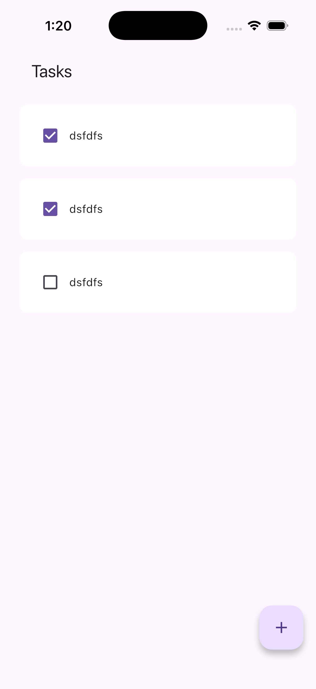
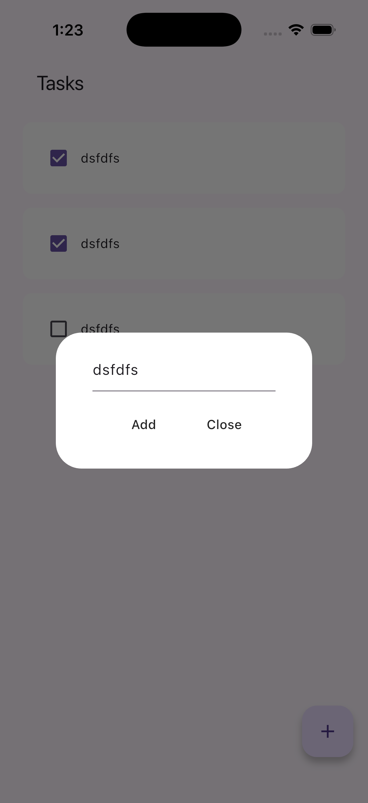

# Flutter-Task-List
⚠️ **Note:** This project is for **learning purposes**.  
I created it while learning Flutter, so the code may be messy or not follow best practices.  
Use it as a reference for my learning journey, not as production-ready code.

## Overview
A simple Flutter task list app focused on buttons and lists.

## Features
- Add Tasks
- Check Tasks when completed

## What it Looks Like

  
  

